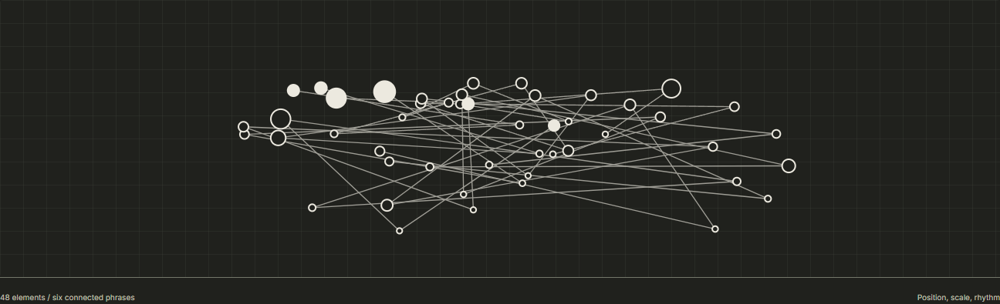

# Style Science

### Design Reasoning for AI, Agents and Automated Systems

**Style is a language. Make its decisions legible.**

Style Science helps people and software express, test and revise design decisions. Its working foundation, the **Generative Design Canvas (GDC)**, connects declared requirements to captured evidence and inspectable results.

It complements design thinking: what does a choice serve, which constraints does it meet, and what remains uncertain? Human needs guide the questions. Human judgment stays in the process.

[Explore the Live Study](https://jongos.github.io/style-science/#design-study) · [Try the Core](#try-it) · [Practical Uses](#what-could-you-use-it-for) · [Research](#contextual-decisions-and-research)

[](https://jongos.github.io/style-science/#design-study)

*Two inputs. Related decisions. Explore structure, expression and derived depth in the live study. This is an authored illustration, not a beauty score.*

| You Bring | GDC Helps You |
| --- | --- |
| A design question | Turn it into explicit requirements and evidence gaps |
| An agent's alternatives | Check declared constraints before carrying a candidate forward |
| A software pipeline | Repeat supported checks across tools and environments |

> **Research prototype.** GDC reports **pass**, **fail** or **unknown** for declared requirements. A passing check is not proof of beauty, usability or human preference. No human study has been run.

---

## From Principles to Working Tools

Our research direction is informed by [Penrose](https://penrose.cs.cmu.edu/docs/ref), [Scout](https://arxiv.org/abs/2001.05424), [C-K design theory](https://www.cambridge.org/core/journals/ai-edam/article/abs/teaching-innovative-design-reasoning-how-conceptknowledge-theory-can-help-overcome-fixation-effects/C6BBCFEB0A1368C37A616E4F26AA7EAC), [Design Model](https://github.com/sherizan/design-model), [AgentsORG / DESIGN](https://github.com/AgentsORG/DESIGN), [design-pact](https://github.com/no7z/design-pact) and the [DTCG token specification](https://www.w3.org/community/reports/design-tokens/CG-FINAL-format-20251028/). They approach different parts of the problem: formal representations, design exploration, executable contracts and interoperability. We acknowledge their contributions without claiming affiliation, endorsement or implemented compatibility. [Related work and proposed experiments](RELATED-WORK.md) distinguish the source ideas from our hypotheses and implementation status.

A type size establishes importance. A distance separates or connects. A color directs attention. Style Science asks how those decisions can become knowledge that travels between tools without making every result look the same.

Three commitments guide the work:

- **Give decisions a reason.** Make assumptions and relationships clear enough to question and improve.
- **Measure what you can defend.** Check concrete requirements, record uncertainty, and keep aesthetic judgment in the review process.
- **Judge the thing people receive.** Inspect the rendered page, document or interface in the conditions where it will be used.

The first working prototype is **Generative Design Canvas (GDC-0)**: portable design knowledge and executable constraint checks for JavaScript and Python. It gives design agents and application developers a way to ask, "Does this candidate satisfy the requirements we declared?"

For example, a brief might require a heading to appear on desktop and mobile, meet a specified contrast ratio, retain a particular color, and avoid horizontal page overflow. GDC-0 evaluates those declared requirements against captured observations and reports **pass**, **fail** or **unknown**.

| Available today | What it provides |
| --- | --- |
| Four HTML constraint checks | Document overflow, declared text visibility, text contrast and computed-style equality |
| JavaScript and Python engines | Dependency-free verification with interoperable reference consumers |
| Optional browser adapter | Observation capture from a host-supplied Playwright Page |
| Portable knowledge library | Preserved reference material, provenance and a smaller registry of scoped entries |
| Candidate filtering | Candidates whose declared checks all pass, ready for human review |
| Mathematical outcome canvas | Bounded effects by metric and environment, with explicit unknowns and preserved tradeoffs |

GDC-0 is an early engineering prototype. It is not a trained generator or a validated model of design quality. No human study has been run. Its current value is a concrete, inspectable starting point for testing requirements and developing the research.

## What Could You Use It For?

Think of **Generative Design Canvas (GDC)** as a shared record of what a design must do, what you observed, and why a decision is justified. Your person, agent or application still creates the design. GDC helps check the reasoning around it.

### For People

**Turn a vague review into an actionable brief.** A designer and developer are reviewing a checkout page. Alongside questions of taste, they declare concrete requirements: the price must be visible, the purchase label must meet a contrast threshold, and the page must not overflow on mobile. GDC checks captured observations and identifies which requirements pass, fail or still lack evidence. The team gets specific things to investigate instead of another round of "make it cleaner." Start with the [example plan](examples/plan.json).

**Compare a redesign without hiding its tradeoffs.** A product team tests a denser dashboard. People finish a lookup faster, but make more mistakes. Supply your measured results, uncertainty bounds and meaningful-effect thresholds to the [outcome canvas](evaluation/CANVAS.md). It reports the outcomes separately rather than compressing them into one flattering score. You still collect the evidence and decide which tradeoffs are acceptable; GDC does not run the user study for you.

### For Agents

**Explore freely, then check the requirements.** A design agent starts with a brief and adapts an idea from the [1,000 recipe starting points](guides/recipes/README.md). After generating and rendering alternatives, it collects observations and uses `filterCandidates` to retain those whose declared checks pass. Failed checks can guide the agent's next revision; unknown results call for more evidence. GDC supplies the checks, not the generator or repair loop. A passing candidate still needs design review: a model-selected recipe is not proof of beauty.

**Stop reusing evidence after an input changes.** An agent revises a palette or typography dependency, but still holds observations from the old revision. The experimental `reviewWithDependencies` helper ([JavaScript](reasoning.mjs), [Python](reasoning.py)) compares current dependency revisions with those recorded alongside the observations. A mismatch blocks advice as unknown rather than treating an old pass as current evidence. The host must track those dependencies and capture new observations; the helper does not discover changes automatically and is not release-qualified.

### For Software Systems

**Catch declared UI regressions before delivery.** A component-library pipeline renders a checkout, navigation bar or pricing table at its supported viewports. Its host-supplied browser adapter captures observations, and the core verifier checks requirements such as overflow, declared text visibility, contrast and exact computed-style locks. A nonzero verification exit code can stop that pipeline's delivery step. This complements existing tests; it is not a complete accessibility audit, visual-diff service or assessment of task usability.

**Share verification across tools without sharing a renderer.** A web builder uses the JavaScript engine while a Python service evaluates saved plans and snapshots. Both can use the same verification contract and report pass, fail or unknown for the supported checks. Keep your framework, design system and approval workflow; integrate the [core engines](#integrate-with-your-tools) where you need inspectable evidence. Verification works locally without Jev or another model call. Documents, slides and other media still need their own native instruments; an HTML check cannot certify Word pagination.

Across these uses, the pattern is the same: **declare the requirement, create the design, collect the evidence, evaluate it, then decide what to change.** GDC makes the declared checks repeatable without pretending that everything worth judging can be reduced to them.

## Try It

The related-work program now has its first implementation: an [experimental token adapter](TOKENS.md) with matching JavaScript/Python behavior, preserved aliases and explicit unsupported-input diagnostics. It supports a small DTCG subset, not the full standard, and never treats declared tokens as observed design evidence.

Integrating GDC into another platform? Start with the [consumer contract](CONSUMER.md): discover supported checks, validate a pinned artifact, and retain your native gates when evidence is missing. The [three-phase issue review](evaluation/ISSUE-PHASES.md) explains the latest correctness fixes and experimental retrieval, browser and document work, including what it does not yet prove.

Clone the repository and enter its directory:

```shell
git clone https://github.com/jongos/style-science.git
cd style-science
```

The verification engines need **Node.js 22+** or **Python 3.10+**, with no third-party runtime dependencies. The test suite uses both runtimes:

Node 22 is the supported and CI-tested minimum, not a claim that every core API requires it. Older releases may run parts of the package but are outside the support contract. The suite discovers `python`, then `python3`, and requires version 3.10 or newer. `GDC_PYTHON` overrides discovery with an explicit executable path; a broken override fails clearly.

```shell
npm test
```

For a small JavaScript example, calculate a contrast ratio directly:

```shell
node --input-type=module -e "import { contrast } from './engine.mjs'; console.log(contrast('#000000', '#ffffff'));"
```

This prints `21`, the contrast ratio of black and white. Next, open the [example plan](examples/plan.json) to see how requirements and desktop/mobile environments are declared.

<details>
<summary><strong>Optional Browser and Site Tests</strong></summary>

### Optional Browser and Site Tests

Use host-provided Playwright, axe-core and an existing Chrome installation. Required core CI does not install or launch a browser. Optional rendered checks are separate:

```shell
npm run test:browser
npm run test:site
```

Set `PLAYWRIGHT_EXECUTABLE_PATH` to the existing browser executable. Hosts supplying Playwright externally can set `GDC_PLAYWRIGHT_MODULE` for adapter tests or `PLAYWRIGHT_MODULE` for site tests, and `AXE_SCRIPT` for axe-core. `test:site` builds the site and writes evidence to `dist/site-evidence/`. These tools are not core runtime dependencies. See [validation boundaries](VALIDATION.md).

</details>

### Verify a Rendered Design

1. Declare the environments and requirements in a plan, using the example as a starting point.
2. Render your artifact and collect observations for each environment with the browser adapter described below.
3. Save the collected snapshots as a JSON array in `snapshots.json`, then run either engine:

```shell
node engine.mjs examples/plan.json snapshots.json
python gdc.py examples/plan.json snapshots.json
```

`snapshots.json` is your capture output; it is not a bundled fixture. Exit `0` means every declared check passed; `2` means a failure or unknown; `1` means invalid input. Set `GDC_PYTHON` to select a Python executable for the test suite.

### Integrate With Your Tools

Copy this repository directory into another project to use the core locally. No Dazzler installation, prompt, rendered examples or network request is needed for verification. React, Vue and other frontend stacks retain their own implementation and render normally.

JavaScript consumers import `verify`, `filterCandidates`, `validatePlan`, `fingerprint` and `contrast` from `engine.mjs`. Python consumers use the corresponding snake_case functions from `gdc.py`. This is interoperability of reference consumers, not an independently authored host adoption study.

For rendered collection, import `capture` from `html.mjs`. Set the host Page viewport and color scheme to each declared environment, load the local artifact, exercise the relevant state, then call `capture(page, plan, environmentId)`. Capture after fonts and application content settle. Each distinct interaction state needs its own declared environment ID and capture. The adapter records actual dimensions/theme and never substitutes the requested values. Host navigation and application code remain outside the verifier's trust boundary.

## Contextual Decisions and Research

The [Contextual Design Science thesis](evaluation/THESIS.md) develops a mathematical direction for the project: feasible designs, task-specific outcome vectors and falsifiable intervention effects. An exploratory Jev pass produced 60 judgments across 30 synthetic scenarios. Two of the 15 scenarios checked under three option presentations changed their winning answer. These are observations of model behavior, not evidence of improved design quality.

The optional [JavaScript decision module](decision.mjs) and [Python counterpart](decision.py) incorporate those findings. They require explicit context, normalize reordered and relabeled options, preserve abstention, and flag unstable advice. `reviewCandidate` (Python: `review_candidate`) recomputes GDC feasibility first, so a model recommendation cannot override a failed or unknown measurement. The modules consume recorded observations without network access; they do not call Jev or rank aesthetics. See the [decision tests](decision.test.mjs) for executable contract examples and [saved analysis](evaluation/jev-pass-2026-10-07/analysis.json) for the evidence.

Decision module 0.3.0 separates advice from release evidence. Record `requestedModel`
(for example, `jev-latest`) separately from `resolvedModel` (`jev-1.13.0`). Legacy
`model` is used only when `resolvedModel` is absent, never when it is explicitly
null or empty. Reports retain per-variant `modelIdentities`. Legacy contracts retain
the exact Jev release rule; bare `sha256:` values no longer qualify. New contracts
can declare `identityPolicy: "1.0.0"` and observations must supply `provider`.
The reviewed [policy](model-identity-policy.json) supports explicit TypeSafe,
OpenAI and Anthropic identities, with a deliberately narrow snapshot allowlist.
Its canonical hash participates in new-contract fingerprints. Policy changes
require fresh contract stamps; old observations are not rewritten. See
[model identity and migration](MODEL-IDENTITY.md).

Aliases, including `jev-latest` and `jev-preview`, may still produce exploratory
`advisory` results, but have `modelIdentityStatus: "unpinned"`,
`evidenceScope: "exploratory"` and `releaseEligible: false`. Missing resolutions
return `needs-model`; mixed resolutions return `model-mismatch`. Only a pinned,
stable substantive advisory passes this narrow gate. Consumers must check
`releaseEligible`, not just `status`. Candidate releases must also use
`reviewCandidate` to require measured feasibility. Neither field authorizes a
release: host review and other evidence requirements remain necessary. An offline
identity check cannot authenticate a provider response or prove that a provider
never reuses a version label. Model agreement is not evidence of aesthetic quality.

Portable release ZIPs now use an [explicit committed manifest](PACKAGING.md).
Dirty working files and unfinished research cannot enter an archive implicitly.

Run the full verification and decision suite with `npm test`. Future hypothesis runs must name the feature they will improve, remove or reject under either result.

### Compare Design Outcomes

The [mathematical canvas](evaluation/CANVAS.md) compares baseline and candidate measurements using explicit units, instruments, context, artifact revisions and meaningful-effect thresholds. It reports improved, worsened, negligible, inconclusive or unknown for each outcome. It preserves tradeoffs and blocks infeasible candidates without assigning a universal style score.

```shell
node examples/canvas.mjs
```

This synthetic example shows a design becoming faster while producing more errors. JavaScript and Python consumers share the same contract. A further 36 Jev judgments informed the semantic boundaries; deterministic tests independently check the arithmetic. The canvas also checks that proposed experiments have a concrete feature decision under either outcome. See the [canvas research record](evaluation/CANVAS.md) for limits and the feature that was rejected.

## How Verification Works

<details>
<summary><strong>Measurement Definitions, Evidence Rules and Limitations</strong></summary>

The technical contract below defines what a passing result actually establishes. Keep these limits alongside any reported results.

### Measurements

- Overflow: `max(0, scrollWidth - clientWidth)`, passing only at zero CSS pixels. This detects document horizontal overflow, not all local clipping or overlap.
- Contrast: normalized sRGB channels use `c/12.92` below/equal to 0.04045, otherwise `((c+0.055)/1.055)^2.4`; luminance is `0.2126R + 0.7152G + 0.0722B`; ratio is `(Ymax+0.05)/(Ymin+0.05)`. Compare unrounded values against the task's explicit threshold. This checks declared text/background pairs, not all accessibility requirements.
- Declared text: an identified element must have a nonzero layout box, visible style and nonzero ancestor opacity, and contain the whitespace-normalized required text. This does not establish absence of occlusion, clipping, offscreen positioning, semantic accuracy or correct reading order.
- Style lock: exact equality of a declared computed CSS property and expected value. This verifies a computed style, not pixel identity or successful loading of the intended font file.

Let each required check in each declared environment return pass, fail or unknown. A candidate is eligible only if all return pass. Any fail yields fail; otherwise any missing, stale, unsupported or malformed observation yields unknown. All-pass yields pass. Empty plans are rejected. No soft preference can compensate for a failed requirement.

Plan identity uses a canonical key-sorted JSON SHA-256. It prevents accidental mixing of revisions and environments, not fabricated evidence. Snapshots are untrusted observations supplied by a host; the package does not authenticate them. Report renderer/browser versions, artifact revision and capture paths with experiment records.

The HTML contrast adapter deliberately supports only visible leaf text with its own opaque solid background and no detected paint effects. Transparent/inherited backgrounds, gradients, nested content and effects return unknown. It does not infer full contrast coverage from a few successful samples. Do not relabel unknown as pass; use an appropriate external measurement or report the gap.

</details>

## Knowledge and Boundaries

### A Language for Design

The experimental [design-language foundation](evaluation/LANGUAGE.md) makes relational design intent portable: typed nodes, containment, reading order, grouping and emphasis. Matching JavaScript/Python consumers validate declarations, calculate inspectable Oklab and type/spacing descriptors, filter explicitly declared contexts, distinguish evidence classes and audit corpus splits for leakage and unresolved rights.

Run `node examples/language.mjs` for a synthetic example or `node evaluation/language-study/run.mjs` for diagnostics over the retained recipe library. These direct-file research modules are not stable package exports or release ZIP contents. They are tested contracts and numerical primitives, not a trained style model, a causal estimator or a universal aesthetic score.

The [rendered relationship study](evaluation/RELATIONS.md) extends that foundation with separate DOM-parent, DOM-order and border-box predicates. JavaScript and Python verify the same captured measurements; the experimental `relation-html.mjs` collector uses a host-supplied Playwright Page. Counterexamples reject treating DOM ownership as visual containment or DOM order as visual order. Perceived grouping, emphasis and meaningful reading order remain unassessed. `npm run test:research:browser` exercises these separate research checks.

### Recipe Starting Points

The [recipe guide library](guides/recipes/README.md) contains **1,000 heuristic winners** from 2,318 distinct color, font, arrangement and prompt combinations screened with 6,954 Jev judgments. Guides are grouped by editorial, commerce, culture, information and software contexts, with complete prompts, numerical settings and vote stability. The search stopped at the requested winner count without relaxing the acceptance rule or rerunning rejected recipes.

These are model-selected ideas to try, not proven beautiful designs. Jev assessed text and numbers, not screenshots. The accompanying collection preserves 300 website URLs from a minimalist design gallery as reference clues, not archived sites or verified visual matches. Only winners and their judgments are retained; losing recipes are not archived. Actual rendering, font loading, accessibility and task fit still need testing in the consuming tool.

`knowledge/registry.json` contains operational entries, scoped hypotheses and links between capabilities. `knowledge/library/` preserves Dazzler's reference knowledge and attribution independently of its prompt and rendered examples. `knowledge/inventory.json` records source hashes and domains. Imported documents are **mixed, uncurated guidance**, not validated atomic scientific claims. Existing composition thresholds remain heuristics; catalog palettes remain references. The preservation inventory is not a claim that all Dazzler knowledge has been formalized.

Keep native medium representations. DTCG tokens and DESIGN.md remain interchange formats handled by existing consumers. Chart semantics should be evaluated through a separately tested Draco 2 adapter; none is installed or claimed here. DOCX pagination, slides, motion, semantic image evaluation and learned ranking remain outside GDC-0.

Generation and final aesthetic judgment stay with the host and reviewer. `filterCandidates` preserves the eligible input order without ranking it. Boldness, distinction and contextual voice remain deliberate review criteria. A numerical distance is not evidence of perceptual diversity. Candidate selection may be extended only with declared instruments and evaluation evidence.

## Help Shape the Work

Useful contributions begin with a concrete design question, a reproducible example, or a limitation you can demonstrate. Good places to start include:

- **Exercise the checks.** Bring a small rendered case that exposes a failure or an unsupported observation, with the expected result.
- **Refine a knowledge entry.** Give a claim a clear scope, source, measurement and counterexample.
- **Explore an adapter.** Preserve the target medium's semantics and define what evidence it can reliably supply.
- **Strengthen the research plan.** Help specify how a proposed benefit could be evaluated before collecting results.

[Open an issue](https://github.com/jongos/style-science/issues) to discuss a question or proposed change. Read the [maintenance guidance](AGENTS.md) for implementation boundaries and required checks, and the [changelog](CHANGELOG.md) for the project's development so far.

### Evolution and Evaluation

Each executable entry names its measurement, scope, evidence class, limitations, tests and version. Changes require fixtures, a version change and an explicit effect on prior outputs. Relations are links between knowledge entries, not a universal graph for every medium. See `evaluation/protocol.json`: research enrollment is blocked until the analysis, practical effect, power analysis, budgets and reviewer sampling are preregistered. No human study has been run.

## Explore the Repository

| Start here | For |
| --- | --- |
| [Manifesto source](site/manifesto.json) and [site design notes](DESIGN.md) | The project's principles and the rationale behind its public page |
| [JavaScript engine](engine.mjs) and [Python engine](gdc.py) | Verification, plan validation, fingerprints and candidate filtering |
| [HTML adapter](html.mjs) | Capturing observations from a rendered page |
| [Example plan](examples/plan.json) | A concrete desktop/mobile requirement set |
| [Knowledge guide](knowledge/README.md) and [registry](knowledge/registry.json) | Source provenance, operational entries and scoped hypotheses |
| [Evaluation protocol](evaluation/protocol.json) | Research status and prerequisites for a future study |

## License and Credits

Original implementation: Apache-2.0; see LICENSE. Imported Dazzler references retain their existing credits and license files. Foundations include [WCAG contrast](https://www.w3.org/WAI/WCAG22/Understanding/contrast-minimum.html), [DTCG 2025.10](https://www.designtokens.org/tr/2025.10/format/), [DESIGN.md](https://github.com/google-labs-code/design.md/blob/main/docs/spec.md), and [Draco 2](https://arxiv.org/abs/2308.14247). These sources do not endorse GDC-0 or establish its quality benefit.
